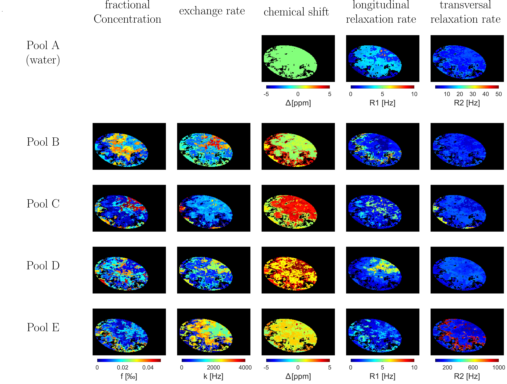

# CEST-Generator

#### **Introduction:**
This repository contains the MATLAB implementation for generating synthetic 2D CEST datasets and in silico phantoms. It is designed to simulate Chemical Exchange Saturation Transfer (CEST) MRI datasets and serves as a reference standard for improving neural network-based noise reduction methods. The repository is an extension of the validated Bloch-McConnell Simulation Tool developed by Zaiss et al.

#### **Related Publications:**
Our work on CEST-Generator is detailed in our recent publication. For an in-depth understanding and insights, please refer to:

- Karl Ludger Radke, Benedikt Kamp, Vibhu Adriaenssens, Julia Stabinska, Patrik Gallinnis, Hans-Jörg Wittsack, Gerald Antoch, and Anja Müller-Lutz. "Deep Learning-Based Denoising of CEST MR Data: A Feasibility Study on Applying Synthetic Phantoms in Medical Imaging." Diagnostics 2023, 13(21), 3326. DOI: [https://doi.org/10.3390/diagnostics13213326](https://doi.org/10.3390/diagnostics13213326)

***If you utilize the code or data provided in this repository, please cite our work in your publications. This will help in acknowledging our efforts and supporting the open science movement.***

#### **Features:**
- **In Silico Phantom Creation**: Generate complex geometric phantoms by layering various geometric shapes of different sizes and arrangements, including ellipsoidal foregrounds to simulate the diversity of biological structures.
- **Parameter Customization**: Customize the parameters for each dataset, including relaxation rates, concentration parameters, and exchange rates, allowing the simulation of a spectrum of 2-5 pool systems.
- **Z-Spectra Generation**: Calculate Z-spectra for each dataset at a voxel level, incorporating Gaussian saturation pulses and variations in MRI parameters like echo time (TE), repetition time (TR), and offset frequency range (??).

#### **Usage:**
1. **Initialize Parameters**: Run `generateCESTPoolParams` to initialize and generate random parameters for each CEST pool.
2. **Generate Phantoms**: Use the main function to create in silico phantoms and generate synthetic CEST datasets.
3. **Analyze and Visualize Data**: Utilize the generated data and Z-spectra for further analysis and improvement of image processing and noise reduction methods in CEST MRI studies.

#### **Requirements:**
- MATLAB (version R2018 or later)

#### **Repository Structure:**
- `/src`: Contains the main scripts and functions for generating in silico phantoms and synthetic CEST datasets.
- `/data`: (If applicable) Holds the generated synthetic datasets and in silico phantoms.
- `/docs`: Contains documentation and additional information on the repository and its components.

#### **Acknowledgements:**
This work extends the Bloch-McConnell Simulation Tool by Zaiss et al. [GitHub Link](https://github.com/cest-sources/BM_sim_fit/). We express our gratitude to the original authors for their valuable contribution to the scientific community.

#### **License:**
This project is available under the GNU license. Please refer to the LICENSE file in the repository for more details.

#### **Contribution & Support:**
Contributions to improve and extend the functionality are welcome. Please refer to the CONTRIBUTING file for guidelines. For support and queries, please open an issue on the GitHub repository.
